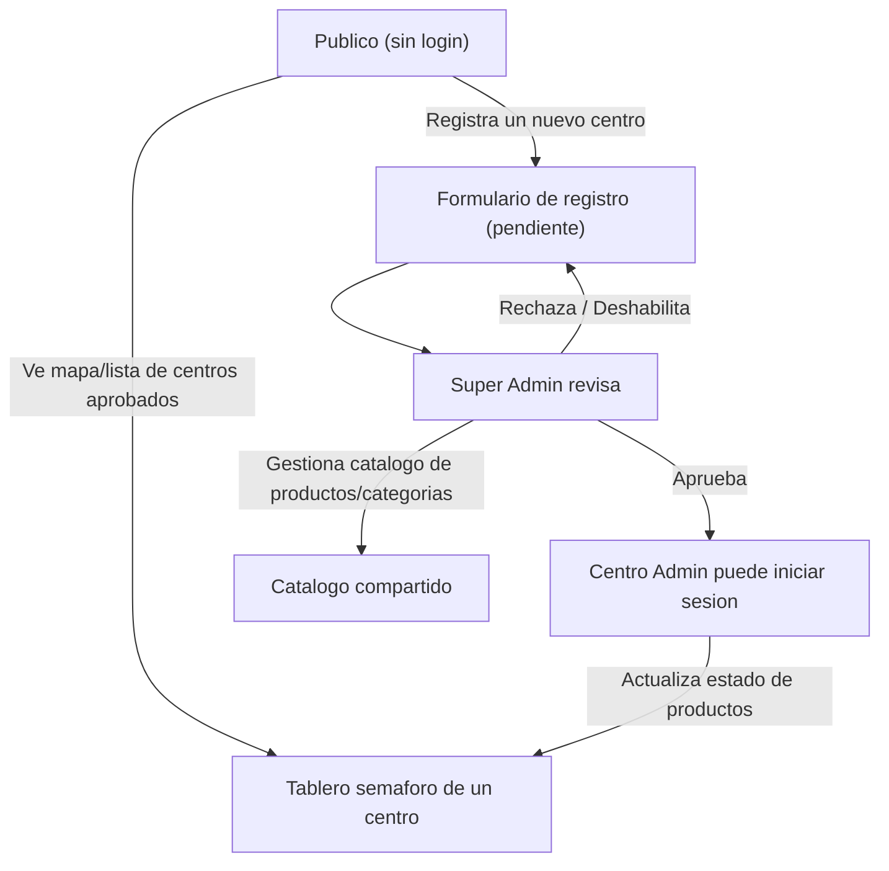

# Centros de Acopio Ven (v2) — Build Prompt / PRD for Cursor Agent

## Context (for the agent)

This is the v2 evolution of the project (formerly AlivioVenezuela). v1 (see [`PRD.md`](./PRD.md)) shipped a
citizen-driven **need-report** tool: anyone dropped a pin for a point-in-time need
(category, urgency, description) and anyone marked it `open → in_progress → covered`.

v2 **replaces** that model with a much simpler idea, inspired by
[centro-acopio-one.vercel.app](https://centro-acopio-one.vercel.app/): a **product
stock semaphore** for collection centers ("centros de acopio"). Instead of ad-hoc
incidents, we track a shared catalog of relief **products**, and each centro publishes
a traffic-light status per product so citizens know exactly what to bring — and what
NOT to bring — before they show up.

The key generalization over the inspiration app: it serves **one** center; v2 serves
**many**, each self-registering and manually approved before going live.

Build a working, deployable web app end to end. Prioritize a functioning vertical
slice over breadth. Keep the UI in Spanish; keep code, comments, and commits in
English.

## What changed from v1

| v1 (`PRD.md`)                                   | v2 (this document)                                        |
| ----------------------------------------------- | --------------------------------------------------------- |
| Citizen reports an ad-hoc **need** at a lat/lng | No ad-hoc reports; a shared **product catalog** is tracked |
| Per-report urgency `critical/high/medium`       | Per-product **stock status** (4-level semaphore)          |
| Status `open → in_progress → covered`           | Status `crítico / necesita_más / suficiente / abundante`  |
| One flat public feed, no auth at all            | Multi-center, with centro registration + approval         |
| No login wall                                   | Two lightweight password tiers (centro admin, super admin) |
| Map pins = individual needs                     | Map pins = **centro locations**                           |
| Duplicate detection, per-report export/share    | Dropped                                                   |

The v1 `needs` / `status_updates` tables, `ReportNeedModal`, and `DuplicateDetector`
are removed. The Next.js + Effect + Supabase + Tailwind + Leaflet foundation is kept.

## Problem

When a disaster hits, citizens want to help but don't know what each collection center
actually needs *right now*. The result is the classic aid-mismatch: one center drowns
in bottled water it can't store while another is out of gauze and baby formula. The
inspiration app solved this for a single municipal center with a live "what to bring"
board. v2 makes that same clarity available to **every** center in the region, from one
public URL, with each center keeping its own board up to date.

## Goal (MVP)

A mobile-first web app with three roles:

1. **Público (no login):** browse approved centers on a map + list, open any center to
   see its live product semaphore (grouped by status level, then category), and register
   a new center.
2. **Centro admin (password per center):** once their center is approved, log in and set
   the stock status of each product for that center only. Changes appear to the public in
   near-real-time.
3. **Super admin (single password, the operator):** approve/reject pending center
   registrations, disable/re-enable any center, and manage the shared product/category
   catalog.

No full user accounts. Auth is intentionally lightweight (passwords + a signed session
cookie) — enough to gate *writers* while keeping the public experience frictionless, in
the spirit of v1's "no login wall for citizens."

## Tech stack

Unchanged from v1 unless noted:

- **Framework:** Next.js (App Router), TypeScript
- **Architecture:** Effect (services, layers, `Schema`, typed errors) — same functional
  core / DI pattern as v1 (`src/domain`, `src/services`, `src/runtime`, `src/lib`).
- **Backend/DB/Realtime:** Supabase (Postgres + Realtime). Public reads via the anon key
  under RLS; all writes go through the server with the service-role key, gated by the
  session check.
- **Map:** Leaflet + OpenStreetMap tiles (no API key). Reused for (a) dropping a pin when
  registering a center and (b) showing all approved centers.
- **Styling:** Tailwind CSS, mobile-first. CSS follows the BEM naming pattern where custom
  classes are written.
- **Deployment:** Vercel — must end with a live, shareable URL.
- **Fallback:** keep v1's demo-mode behavior — with no Supabase env vars, run on a seeded
  in-memory store so the deployed URL is never blank.

## Data model (minimum)

Model these as Effect `Schema.Class` types in `src/domain`, decoding from snake_case
Postgres rows into camelCase domain objects (same style as `src/domain/Need.ts` in v1).

### `categories`

- `id`
- `name` (e.g. "Alimentos", "Higiene Personal")
- `sort_order`

Seeded from the inspiration app's groups: Alimentos, Higiene Personal, Insumos Médicos,
Medicamentos, Artículos del Hogar, Herramientas, Ropa y Calzado, Colchonetas y Ropa de
Cama, Juguetes, Colores y Dibujos, Otros.

### `products`

- `id`
- `category_id` → `categories.id`
- `name` (e.g. "Agua potable", "Arroz", "Guantes", "Cloro")
- `sort_order`

Seeded from the ~101 items observed in the inspiration app. Managed **only** by the super
admin (the catalog is shared across all centers so statuses are comparable).

### `centros_acopio`

- `id`
- `name`
- `slug` (unique, for public URL `/centros/[slug]`)
- `address_label` (free text)
- `lat`, `lng`
- `contact_name` (optional)
- `contact_phone` (optional)
- `admin_password_hash` (set at registration, used for centro-admin login once approved)
- `registration_status` (enum: `pending | approved | rejected | disabled`)
- `created_at`, `approved_at`

### `product_status`

- `id`
- `centro_id` → `centros_acopio.id`
- `product_id` → `products.id`
- `status` (enum: `critico | necesita_mas | suficiente | abundante`)
- `updated_at`
- `updated_by` (free text / "centro admin")
- unique on (`centro_id`, `product_id`)

A center only shows products for which it has explicitly set a status — no "N/A" noise on
the public board.

### Semaphore levels (reuse the inspiration app's copy + colors exactly)

| Status         | Emoji | Color  | Public message                                                     |
| -------------- | ----- | ------ | ----------------------------------------------------------------- |
| `critico`      | 🚨    | red    | "Sin stock. Por favor trae estos artículos con prioridad."        |
| `necesita_mas` | ⚠️    | yellow | "Quedan pocas unidades. Tu donación ayudaría mucho."              |
| `suficiente`   | ✅    | green  | "Inventario adecuado por ahora. Puedes donar si deseas."          |
| `abundante`    | 📦    | blue   | "No traer — estamos bien abastecidos. Por favor dona lo de arriba." |

Define this metadata in `src/lib/constants.ts` (Spanish labels + hex colors + Tailwind
badge classes), the same way v1 defines `URGENCY_META` / `STATUS_META`.

## Roles & flows

## Core user flows

1. **Register a centro (public):** a form asks for name, address, a pin dropped on the map
   (reuse v1's `LocationPickerMap`), optional contact name/phone, and a desired admin
   password. Submitting creates a `centros_acopio` row with `registration_status = pending`.
   Show a clear "pending approval" confirmation. The center is NOT publicly visible yet.
2. **Super admin review:** super admin logs in (single password) and sees a list of
   `pending` centers with their details + map pin. Approve → `approved` (activates the
   center's admin login and makes it publicly visible). Reject → `rejected`. Can later
   disable/re-enable any `approved` center (`disabled` hides it from the public and blocks
   its admin login).
3. **Browse centros (public, no login):** map + list of `approved` centers only. Pins
   colored/summarized by how many critical items each center has. Reuse v1's Leaflet map
   plumbing, repointed at center locations.
4. **View a centro's board (public):** at `/centros/[slug]`, show collapsible sections by
   status level (with counts per level, like the inspiration app), and within each level
   group products by category. Header shows center name, address, contact, and "última
   actualización".
5. **Centro admin manages stock:** center admin logs in with that center's password, sees
   the full product catalog, and sets/updates each product's status via large tap targets.
   Updates propagate to the public board in near-real-time via Supabase Realtime (reuse the
   channel-subscription pattern in `src/components/NeedsDashboard.tsx`).

## Auth model

- **Two password tiers**, both simple — no email, no full accounts:
  - **Centro admin:** one password per center, chosen at registration, hashed at rest,
    usable only when the center is `approved`. Scope: that center's product statuses and
    its own profile.
  - **Super admin:** a single password (env var / seeded), for the operator. Scope: approve
    /reject/disable centers and manage the shared catalog.
- On successful login, set a **signed, httpOnly session cookie** identifying the role and
  (for centro admins) the `centro_id`. Server route handlers verify this cookie before any
  write. The service-role key never reaches the browser.
- Login pages mirror the inspiration app's `/admin` styling ("Acceso Administrativo").

## Acceptance criteria for MVP

- [ ] A citizen can browse approved centers and open any center's product board on a phone
      without logging in.
- [ ] Registering a new center creates a `pending` record that is NOT publicly visible.
- [ ] The super admin can approve a pending center; it then appears publicly and its admin
      can log in.
- [ ] The super admin can disable an approved center; it disappears from the public view and
      its admin can no longer log in.
- [ ] A centro admin can set/change a product's status and it is reflected on the public
      board without a manual refresh (Realtime working).
- [ ] The public board groups products by status level (with counts) and then by category,
      matching the inspiration app's semaphore semantics/colors.
- [ ] The map shows only approved centers, at their registered locations.
- [ ] All write endpoints reject requests without a valid session cookie for the correct
      role/scope.
- [ ] Usable one-handed on a small phone: large tap targets, no horizontal scroll, clear
      pending/error/success states on slow connections.
- [ ] Deployed to a public URL.

## Out of scope for v2 MVP

- Full user accounts / email auth / password reset flows (only simple passwords).
- Per-product change history / audit trail (a single `updated_at` is enough).
- Self-serve catalog editing by centro admins (catalog is super-admin-only).
- Payments or donation processing, SMS/WhatsApp integration, push notifications.
- Multi-language support (Spanish only for v2).
- Quantities/units per product (status level only — keep it simple, like the inspiration
  app).

## Stretch goals (only after MVP is working and demoed)

1. Aggregate "most critical items across all centers" view for the super admin.
2. Per-center shareable text export ("qué llevar a este centro") for offline handoff.
3. Search/filter centers by name or state; cluster pins when many centers overlap.
4. Product-status change history / simple timeline.
5. Lightweight throttling on the public registration form (no auth) to deter spam.

## Migration notes

- New Supabase migration **replaces** v1's `needs` and `status_updates` tables with:
  `categories`, `products`, `centros_acopio`, `product_status` (plus the two status enums).
- Seed `categories` and `products` from the inspiration app's ~101 items.
- **RLS:** public (anon key) may read `categories`, `products`, `approved`-and-not-`disabled`
  `centros_acopio`, and the `product_status` rows of those centers only. No public write
  access — every write goes through a server route handler using the service-role key after
  the session/role check.
- Keep the demo-mode in-memory fallback (mirror v1's `MockNeedsRepository`) so the app runs
  with zero Supabase config: seed one approved sample center with a few product statuses.

## Working instructions for the agent

- Build incrementally: catalog + data model → public browse (map/list) → center registration
  → super-admin approval → centro-admin login + status editing → realtime sync → polish.
- After each milestone, run the app and capture a screenshot for review.
- Keep the UI in Spanish; keep code comments and commit messages in English. Write custom CSS
  following the BEM pattern where practical.
- Reuse v1 infrastructure (Effect services/layers, Supabase realtime pattern, Leaflet map,
  Tailwind shell, demo-mode fallback). Delete v1 need-report code paths that no longer apply.
- If a blocker requires manual approval of a third-party service, stub it and flag it rather
  than stalling.

## Demo narrative (for the submission)

"After the June 24, 2026 earthquake doublet in Yaracuy and Carabobo, dozens of collection
centers opened overnight — but citizens had no idea what each one actually needed. Some
centers overflowed with water while others ran out of gauze. Centros de Acopio Ven gives every
center a live 'traffic light' of what to bring (and what not to), all from one public URL.
Centers self-register, an operator approves them, and each center keeps its own board current
in real time."
